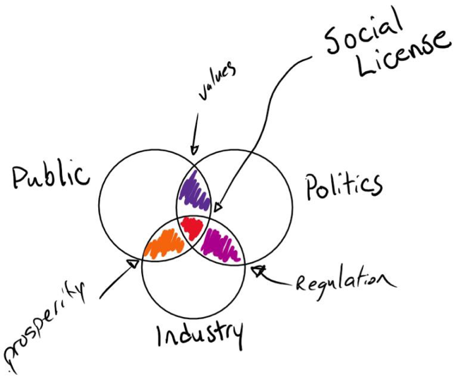

# Social License
## Exploration of Social Licence in Oil and Gas
### Background 

Every project, big or small, is comprised of people. People responsible for the project (Industry), people impacted by the project (Public), and the people responsible for ensuring it’s completed responsibly (Government) all have a role to play in the life of a project. Combined, these groups act as the stakeholders in determining the fate of any project, but do we truly understand why do some projects go forward, while others do not? This concept is known as “Social Licence”. 
 

Our objective is to explore what successful and unsuccessful Social License looks like through the perspective of major oil and gas infrastructure projects. 

By taking a holistic approach, leveraging social, political and economic data, we aim to better understand social licence. 

1. Do different media reveal marked differences in social acceptance measurements? 
2. What is the geographic dispersion of interest (acceptance or opposition) to some large oil or gas pipeline projects?
3. Is there a correlation between demographic or income or political affiliation/representation of a region and the measure of interest (acceptance or opposition)?
4.  Can we uncover a historical trend to interest in major projects?  Does acceptance or opposition change over time?
5. Does public interest (acceptance or opposition) correlate to the length of time between project application and operation of the facility?  Was there a marked/significant change after 2012 when the Jobs, Growth and Long Term Prosperity Act put a time limit on NEB project assessment?
6.  How have large energy projects evolved in the length of time from project application to operation? 

### Data Curated for Social Licence Exploration
* Hearing Statistics – Data from Canada’s federal energy regulator from 2007-2018, The National Energy Board.  The dataset provides information about the approval process for large and small oil and gas pipeline and facility (e.g. processing plants, etc.) and some international power line applications.  The data give information on dates of significant stages of the regulatory approval process, decision types, outcomes, environmental assessment, participants and the complexity of the decision.  There are links to applicable hearing folders for ease of access to download or view documents.  Data dictionary included within the excel file.
* Factiva News Files – Canadian News searches from Factiva global news database.  Search files in .txt and .htm formats.  Factiva Database News Search Notes outline the search terms used
* Federal Election Results – Data on election results for every riding in Canada from 2006 to our most recent federal election (2015) with political party affiliation of every elected Member of Parliament. Data comes from the House of Commons website.  Data dictionary and notes included in the excel file.
* Census Data – Census data from Statistics Canada for 2011 and 2016, in several formats and sorted by: i) Federal Electoral District, or ii) Forward Sorting Area (first 3 digits of postal code).  The data include population and dwelling counts, age characteristics, marital status, family characteristics, household and dwelling characteristics, language, etc.  Data Dictionaries are included in the excel files.  Metadata and other explanations are provided in metadata files from the Statistics Canada download.  
* Media Requests – Data from Canada’s federal energy regulator from 2006-2018, The National Energy Board.  The dataset (largely text) provides information requests to the regulator from media.  The data give the date of the request, the media outlet, the request, the information provided.  More recent data entries include a general theme or topic of the request. Names of reporters and NEB staff removed for privacy reasons.
